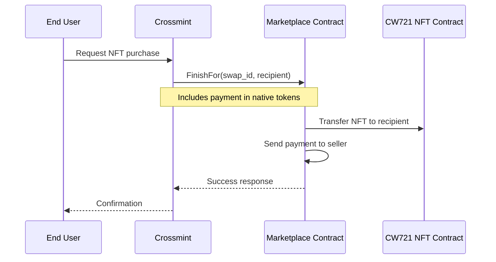

# Crossmint Integration Guide for CW721 Marketplace

## Overview

This guide explains how to integrate Crossmint's payment solution with the CW721 Marketplace contracts on XION. The marketplace contracts support Crossmint's requirements for secondary sales, allowing Crossmint to purchase NFTs on behalf of end users.

## Contract Compatibility

All three marketplace variants support Crossmint integration:

1. **cw721-marketplace** - Open marketplace for any CW721 NFT
2. **cw721-marketplace-single-collection** - Single collection marketplace
3. **cw721-marketplace-permissioned** - Curated multi-collection marketplace

## Key Features for Crossmint

### FinishFor Function

The `FinishFor` execute message enables Crossmint to purchase NFTs on behalf of users:

- **Public Access**: Function is publicly callable
- **Payable**: Accepts native XION tokens
- **Recipient Parameter**: Specifies the actual NFT recipient
- **Direct Transfer**: NFT transfers directly to the recipient, not the payer

## Integration Flow



## Message Format

### Execute Message - FinishFor

```json
{
  "finish_for": {
    "id": "swap_unique_id",
    "recipient": "xion1recipient_address..."
  }
}
```

### Parameters

- `id` (String): The unique identifier of the swap/listing
- `recipient` (String): The XION address where the NFT should be sent

### Payment

Payment must be included with the transaction as native XION tokens:

```json
{
  "funds": [
    {
      "denom": "uxion",
      "amount": "1000000"
    }
  ]
}
```

## Query Endpoints

### Get Listing Details

```json
{
  "details": {
    "id": "swap_unique_id"
  }
}
```

Returns swap details including:
- NFT contract address
- Token ID
- Price
- Payment token (null for native)
- Seller address
- Expiration

### Get All Active Listings

```json
{
  "get_listings": {
    "page": 0,
    "limit": 100
  }
}
```

### Get Listings for Specific NFT

```json
{
  "listings_of_token": {
    "token_id": "token123",
    "cw721": "xion1nft_contract...",
    "swap_type": "sale",
    "page": 0,
    "limit": 10
  }
}
```

## Integration Examples

### CosmJS/TypeScript Integration

```typescript
import { SigningCosmWasmClient } from "@cosmjs/cosmwasm-stargate";
import { GasPrice } from "@cosmjs/stargate";

interface FinishForMsg {
  finish_for: {
    id: string;
    recipient: string;
  };
}

async function purchaseForUser(
  client: SigningCosmWasmClient,
  marketplaceAddr: string,
  crossmintWallet: string,
  swapId: string,
  recipientAddr: string,
  price: string
) {
  const msg: FinishForMsg = {
    finish_for: {
      id: swapId,
      recipient: recipientAddr
    }
  };

  const funds = [{
    denom: "uxion",
    amount: price
  }];

  const result = await client.execute(
    crossmintWallet,
    marketplaceAddr,
    msg,
    "auto",
    "Crossmint purchase for user",
    funds
  );

  return result;
}
```

### Query Listing Before Purchase

```typescript
async function queryListing(
  client: SigningCosmWasmClient,
  marketplaceAddr: string,
  swapId: string
) {
  const query = {
    details: {
      id: swapId
    }
  };

  const listing = await client.queryContractSmart(
    marketplaceAddr,
    query
  );

  return listing;
}
```

## Error Handling

Common error scenarios and handling:

### Insufficient Funds
- **Error**: Payment amount less than listing price
- **Solution**: Ensure payment matches the exact listing price

### Expired Listing
- **Error**: Swap has expired
- **Solution**: Query listing details first to check expiration

### Already Sold
- **Error**: Swap not found (already completed)
- **Solution**: Implement proper error handling and user notification

### Invalid Recipient
- **Error**: Invalid address format
- **Solution**: Validate XION address format before sending

## Security Considerations

1. **Price Verification**: Always query the current listing price before purchase
2. **Expiration Check**: Verify listing hasn't expired
3. **Address Validation**: Validate recipient address format
4. **Transaction Monitoring**: Monitor transaction status for success/failure
5. **Idempotency**: Implement request tracking to prevent duplicate purchases

## Testing on Testnet

1. Deploy marketplace contract on XION testnet
2. Create test NFT listings
3. Test FinishFor with various scenarios:
   - Successful purchase
   - Expired listings
   - Insufficient funds
   - Invalid swap IDs

## API Response Format

### Successful Purchase Response

```json
{
  "transactionHash": "...",
  "height": 123456,
  "gasUsed": 150000,
  "events": [
    {
      "type": "wasm",
      "attributes": [
        { "key": "action", "value": "finish_for" },
        { "key": "swap_id", "value": "swap_unique_id" },
        { "key": "token_id", "value": "token123" },
        { "key": "recipient", "value": "xion1recipient..." },
        { "key": "price", "value": "1000000" }
      ]
    }
  ]
}
```

## Support for CW20 Tokens

While the primary integration uses native XION tokens, the marketplace also supports CW20 token payments. For CW20 listings:

1. Crossmint must first approve the marketplace contract to spend CW20 tokens
2. The FinishFor message remains the same
3. No funds are attached to the transaction (payment handled via CW20 transfer)

## Support

- Review the contract source code in `/contracts/cw721-marketplace/`
- Run integration tests: `cargo test crossmint`
- Check example implementations in `/contracts/cw721-marketplace/src/integration_tests/crossmint.rs`